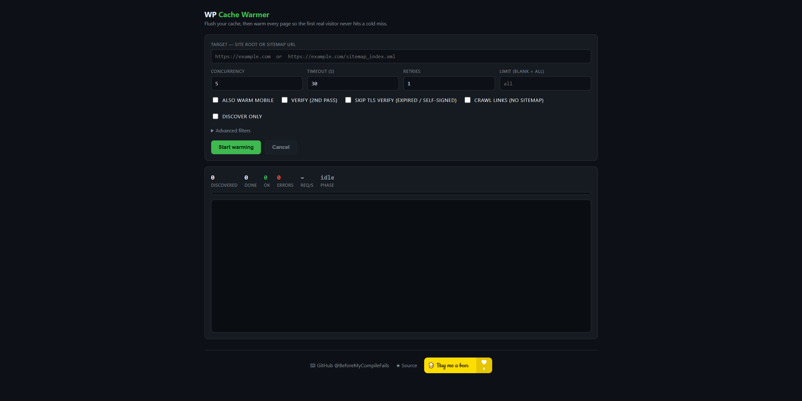

# WP Cache Warmer 🔥

**Warm your WordPress page cache so the first real visitor never hits a cold miss.** A single-file Python tool that crawls every URL on your site — from a sitemap (auto-discovered or supplied) or by following internal links — and requests each page to prime W3 Total Cache, WP Super Cache, WP Rocket, LiteSpeed Cache and Cloudflare. Ships with both a command-line interface and a live web UI.




## Why

A page cache only helps **after** it's populated. Right after you flush the cache (a deploy, a plugin update, a scheduled purge), every page is cold — the first visitor to each URL pays the full PHP render cost. This tool walks the whole site immediately after a flush so your cache is hot before real traffic arrives. Drop it in a cron job or Task Scheduler task right after any scheduled purge.

## Features

- **Sitemap-aware** — auto-discovers sitemaps from `robots.txt` and common paths, follows sitemap-index files recursively, and handles gzipped sitemaps. Or point it straight at a sitemap URL.
- **Link crawler fallback** — no sitemap? It crawls internal links (asset and off-domain links filtered out).
- **Concurrent** — configurable worker pool; warms hundreds of URLs in parallel.
- **Cache detection** — reports which caching layer served each page. `LiteSpeed` and `Cloudflare` give exact `hit`/`miss` from response headers; W3TC / WP Super Cache / WP Rocket are detected from their page footer.
- **Verify pass** — optional second pass that reports the speed-up and flags any pages *still* slow (i.e. the cache isn't catching them — cart, checkout, dynamic endpoints).
- **Mobile warming** — optionally warm every URL a second time with a mobile User-Agent to prime device-specific cache buckets.
- **Skip TLS verify** — for staging sites with expired or self-signed certificates.
- **Filters** — include/exclude by regex, limit the number of URLs, discover-only (dry run).
- **Single file, zero deps for the engine** — the warmer engine is pure Python standard library; only the web UI needs Flask. Runs on Linux and Windows with any Python 3.7+.

## Requirements

- Python 3.7+
- [Flask](https://flask.palletsprojects.com/) — only required for the web UI (the CLI needs nothing beyond the standard library)

## Install

```bash
git clone https://github.com/BeforeMyCompileFails/WP-Cache-Warmer.git
cd WP-Cache-Warmer
pip install flask
```

## Usage

### Web UI

```bash
python warmer.py                      # http://127.0.0.1:5000
python warmer.py --host 0.0.0.0 --port 8080   # expose on LAN / behind a tunnel
```

Open the page, enter a site root (`https://example.com`) or a sitemap URL, set your options and hit **Start warming**. Progress streams in live (per-URL status, timing, size, detected cache layer), followed by a summary and — if enabled — a verify panel. The SSE endpoint sets `X-Accel-Buffering: no`, so it streams correctly behind nginx.

### CLI

```bash
python warmer.py cli https://example.com
python warmer.py cli https://example.com/sitemap_index.xml -c 8 --mobile --verify
python warmer.py cli https://example.com --exclude "/cart|/checkout" --insecure
python warmer.py cli https://example.com --dry-run        # just list discovered URLs
```

| Flag | Description |
|------|-------------|
| `target` | Site root or sitemap URL (auto-detected) |
| `--sitemap URL` | Explicit sitemap (repeatable) |
| `--urls-file PATH` | Warm URLs from a newline-delimited file |
| `--crawl` | Discover by crawling links instead of a sitemap |
| `-c, --concurrency N` | Parallel requests (default 5) |
| `-t, --timeout SEC` | Per-request timeout (default 30) |
| `--retries N` | Retries on network/5xx errors (default 1) |
| `--delay SEC` | Pause after each request per worker |
| `--mobile` | Also warm every URL with a mobile UA |
| `--insecure` | Skip TLS certificate verification |
| `--include / --exclude REGEX` | Filter URLs (repeatable) |
| `--limit N` | Warm only the first N URLs |
| `--verify` | Second pass; report speed-up and still-slow pages |
| `--dry-run` | List discovered URLs and exit |
| `-q, --quiet` | Summary only |

## How cache detection works

| Layer | Signal | Hit/miss accuracy |
|-------|--------|-------------------|
| LiteSpeed Cache | `X-LiteSpeed-Cache` header | Exact |
| Cloudflare | `CF-Cache-Status` header | Exact |
| W3 Total Cache | page footer comment | Presence (use `--verify` for ground truth) |
| WP Super Cache | page footer comment | Presence |
| WP Rocket | page footer / `x-rocket-*` header | Presence |

For layers without a clean header signal, the **verify pass** is the reliable check: warm once, run a second pass, and compare timings — a uniform speed-up means the cache is hot, and any page that's still slow on pass two is one the cache isn't serving.

## Notes

- Warming only helps **after a flush** — schedule it right after any cache purge.
- Behind a reverse proxy or Cloudflare tunnel, run it locally first (`http://127.0.0.1:5000`) to rule the proxy in or out if something misbehaves.
- The web UI is a single self-contained page — no CDN, no external assets.

## License

MIT — see [LICENSE](LICENSE).

## Author & support

Made by [**BeforeMyCompileFails**](https://github.com/BeforeMyCompileFails). If it saved you some time, you can buy me a beer:

<a href="https://www.buymeacoffee.com/beforemycompilefails" target="_blank"></a>
